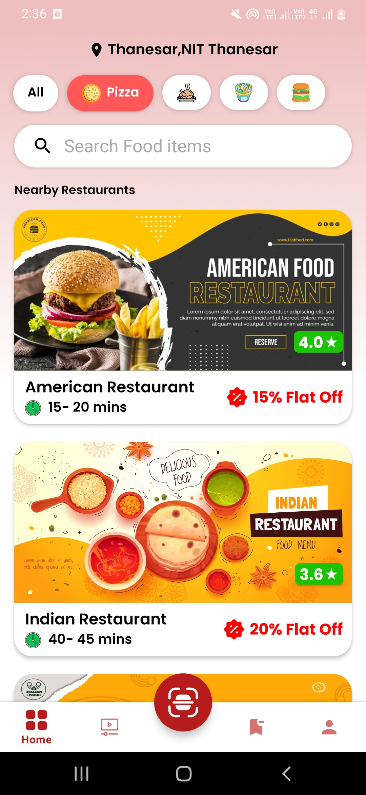
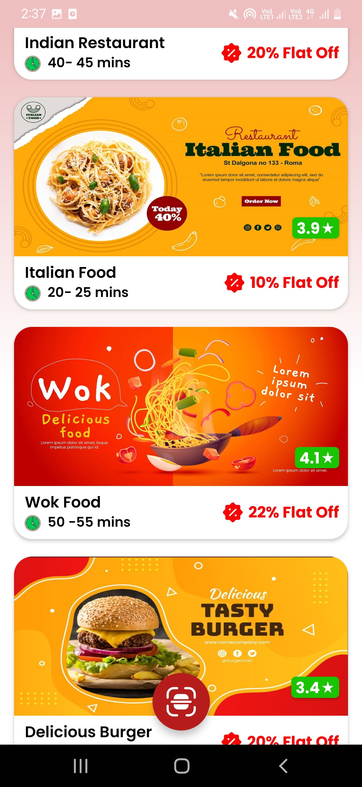

# Food-Delivery-App

## What you should know
1. Android basics (project structure, how to make hello world! app )
2. Java Basics

## Features
1. Fetching current geo-location and displaying it on top.
2. Api caliing to get restaurants nearby your location.
3. Displaying Information in recylerView.
4. Searchview to search restaurants.
5. Bottom App bar for switching screens.

## Techniques
RecycleView, ToolBar, CardView, Volley, Json, ListView, NestedScroll, DrawerLayout, ActionBarDrawerToggle, Floating Action Button, Fragments, Fetching Current Geolocation.

## Develeped By
* Auther : Aman Pandey
* Email  : amanpandey12398@gmail.com

Here are some screenshots of app

For further clarfications or doubts you can connect with me at amanpandey12398@gmail.com 
